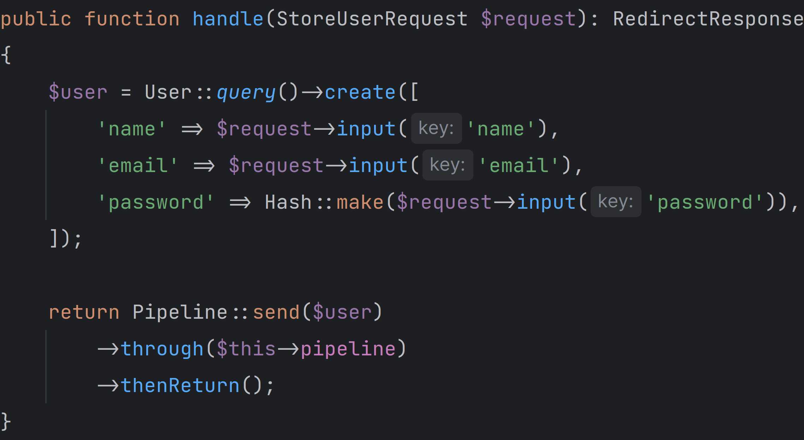
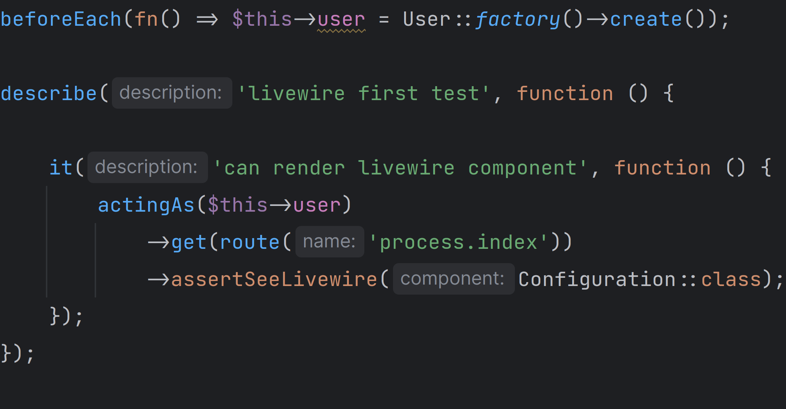
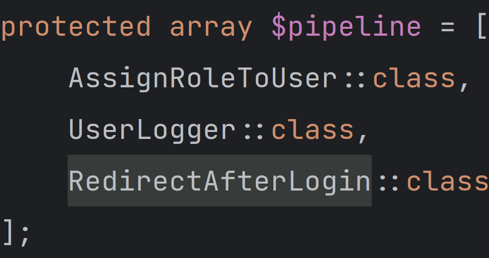
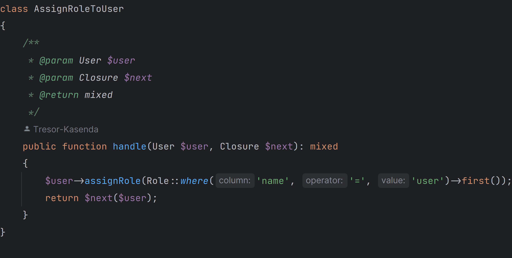

# VINCO ADMINISTRATTION



Vinco est une solution adapter aux ecoles et aux universites parce qu'elle permet:

- Un bon deroulement des cours et la structuration des institutions d'enseignement
- Une gestion de communication grace a une email interne, messagerie interne,
- une mise en relation entre des etudiants et les professeurs grace a un messagerie et un mini reseau social temps reel
- un moyen facile de consulter facilement l'horaire, note d'examen, depot de tp,
- une communication entre ecole et les parents
- un moyen de faire des etudes en lignes





## Procesuss de deroulement du projet

- Definir le besoin fonctionnel de la plateforme
- Elaborer les cas d'utilisateur
- Subdiviser les taches en sous taches en utilisant le principe ```diviser pour mieux regner```
- Definir les relations entre chaque cas d'utilisateur

## **Fonctionnalite**

- [x]  Page de presentation de la plateforme
- [x]  Inscription de l'utilisaeur
- [ ]  Procedure de selection entre etudiant et chef d'institution
- [ ]  creation de l'institution
- [ ]  Definir l'annee academique (scolaire)
- [ ]  Acceder au dashboard
- [ ]  gestion des roles et autorisation
- [ ]  Gestion des utilisateurs
- [ ]  parametre du logiciels
- [ ]  gestion des campus
- [ ]  gestion des departements
- [ ]  gestion des promotion
- [ ]  gestion des Filiaire
- [ ]  gestion des professeurs
- [ ]  gestion categories
- [ ]  gestion des cours
- [ ]  gestion des chapitres
- [ ]  Gestion des lecon
- [ ]  Gestion des exercice et devoir
- [ ]  Gestion des interrogation et examens
- [ ]  gestion d'horaire
- [ ]  Affecter un cours a une promotion
- [ ]  Lister les etudiants d'une promotion
- [ ]  Lister les etudiants qui participe a un cours
- [ ]  Lister les cours d'une promotion
- [ ]  Lister les professeurs et assistants associer a un cours
- [ ]  Lister la moyenne des cours des etudiants
- [ ]  Ecouter tous les evenements de l'application ainsi que afficher toute les notfications des toute les events
- [ ]  Aperi
- [ ]  gestion des etats financiers des etudiants
- [ ]  gestion des evenements academiques
- [ ]  gestion des notifications
- [ ]  gestion d'horaire (Cours, Examen, Calendrier Scolaire, Journal de classe)
- [ ]  Publication des Resultat
- [ ]  Systeme de messageries instatanee pour communication professeurs etudiants
- [ ]  Un PWA et SP pour qu'il soit installable sur mobile
